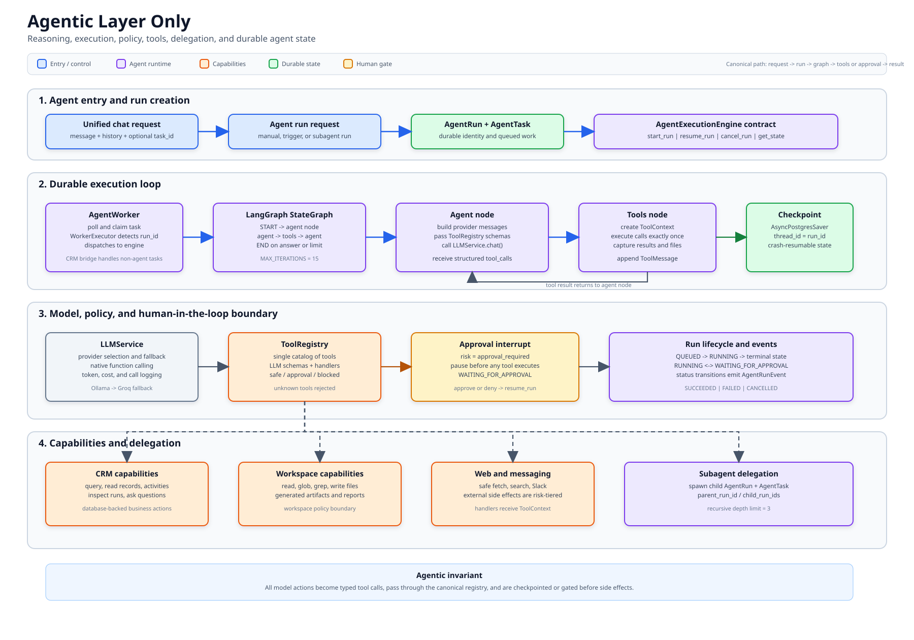
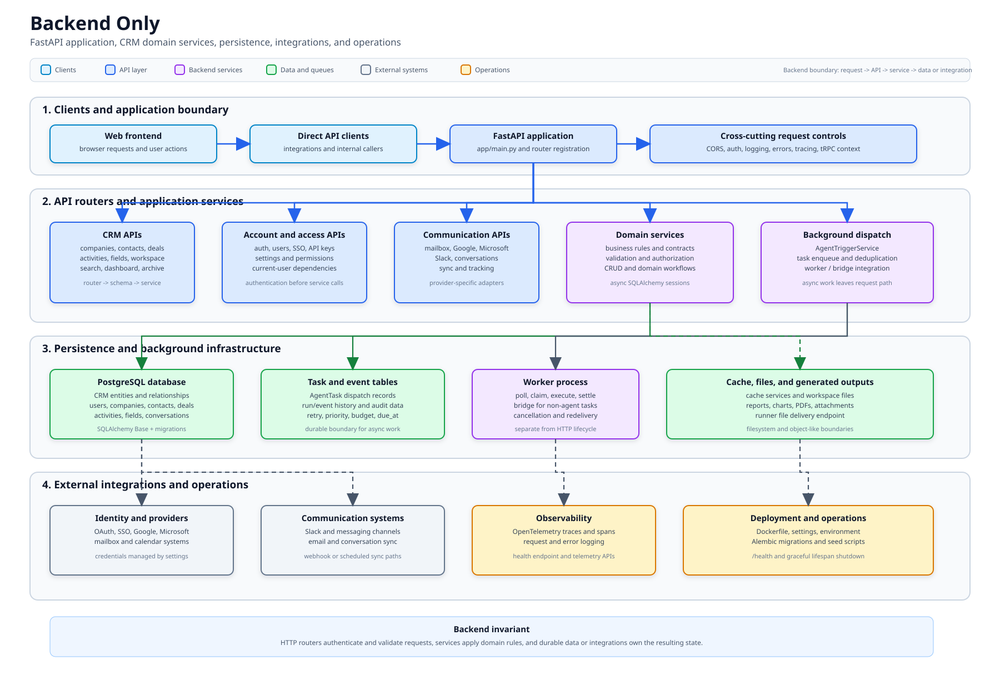
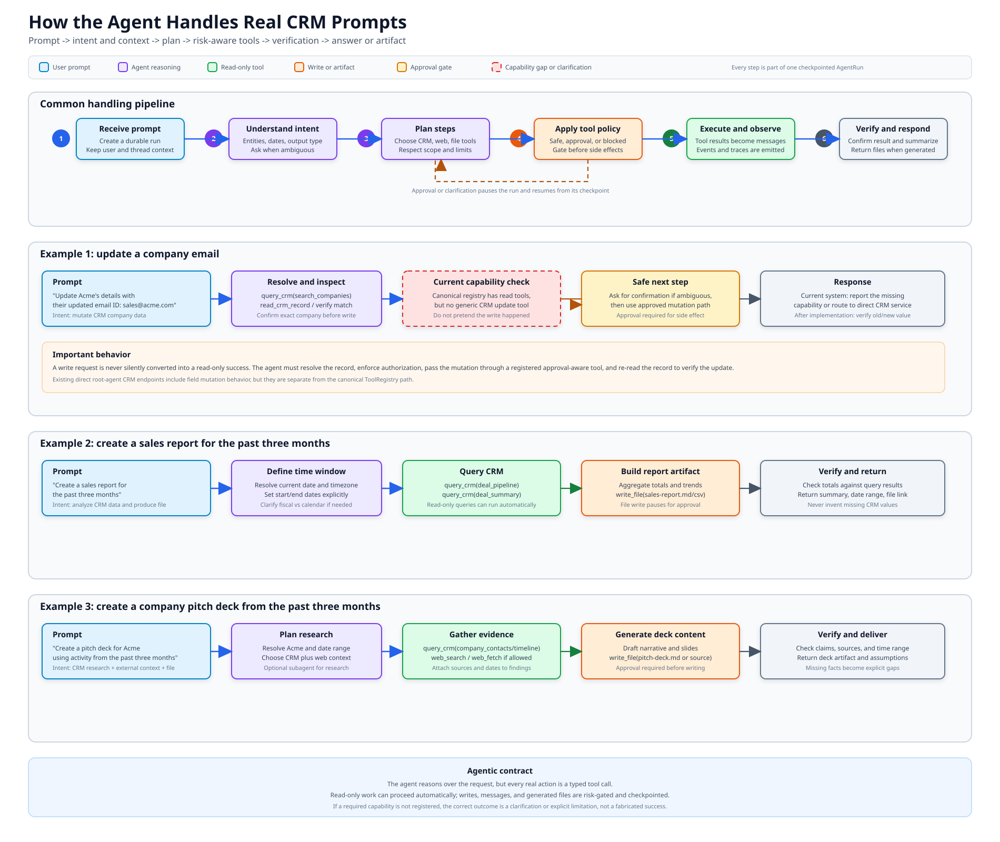
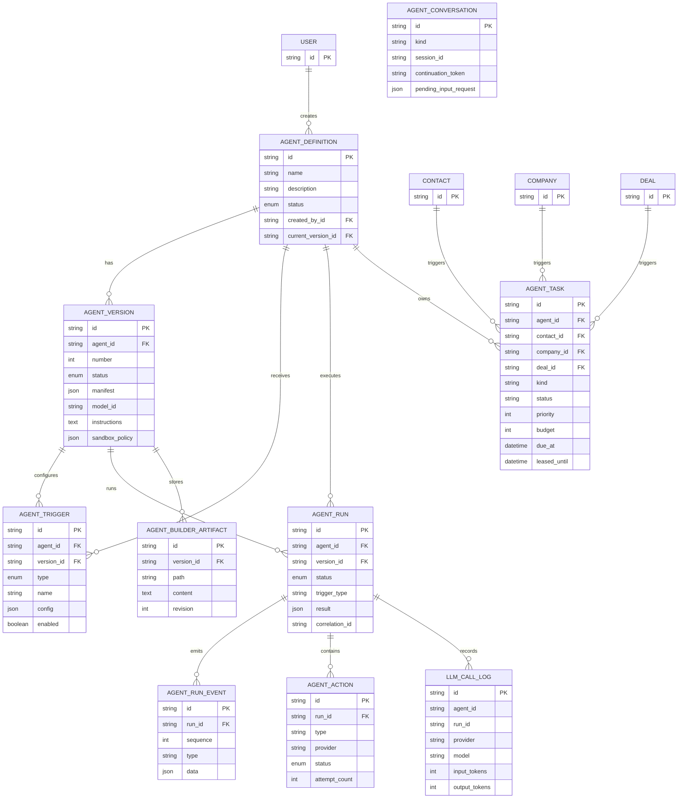

# FastAPI Agent Backend

This directory contains the FastAPI implementation of the CRM agent APIs. It owns
CRM data, task records, dispatch integration, and a lightweight agent runtime.

## Architecture Images

Use the two focused diagrams for the current architecture:

### Agentic layer only

[Open the agentic-only architecture diagram](agentic-only-architecture.svg).
It covers durable runs, LangGraph reasoning, native tool calling, approval gates,
canonical tools, subagent delegation, checkpoints, and LLM providers.



### Backend only

[Open the backend-only architecture diagram](backend-only-architecture.svg).
It covers FastAPI startup, middleware and authentication, CRM domain modules,
database persistence, dispatch infrastructure, integrations, and observability.



### Prompt execution examples

[Open the prompt execution examples diagram](agentic-prompt-execution-examples.svg).
It traces a company-email update, a three-month sales report, and a company pitch
deck from user prompt through intent detection, planning, tool policy, approval,
verification, and the final response or artifact. It also marks the current
canonical-registry limitation for generic CRM field updates.



The earlier combined diagram remains available as
[agentic-layer-architecture.svg](agentic-layer-architecture.svg).

For the complete written layer descriptions, see:

- [Backend layer](backend.md)
- [Agentic layer](agentic.md)

## Current Architecture

The canonical durable FastAPI flow is:

```text
HTTP request or domain trigger
   -> AgentTask queue
   -> AgentWorker / WorkerExecutor
   -> AgentRun lifecycle
   -> LangGraph checkpointed state
   -> LLMService native tool calling
   -> approval gate or ToolRegistry execution
   -> tool result added to graph state
   -> repeat until final answer, limit, or terminal failure
```

## Visual Architecture

The standalone image above is the source of truth for the updated agentic layer.
Solid components represent the current durable path. Dashed red components mark
legacy or incomplete paths that remain in the codebase for compatibility.

The detailed Mermaid sections below are retained as historical design notes and
may describe the pre-LangGraph orchestrator; use the standalone SVG for the
current architecture.

### 1. Unified Agent Request Flow

```mermaid
flowchart TD
   U[User or frontend]
   API[POST /api/agents/unified/chat]
   ROUTE[route(message)\nkeyword matching]
   ORCH[Orchestrator.run()\nmax 15 iterations / 8000 estimated tokens]
   STATE[(In-memory AgentState)]
   LLM[LLMService\nOllama or Groq]
   PARSE[_extract_tool_calls()\nmanual JSON parsing]
   GUARD[_check_guardrail()]
   ROOT[Root agent\nCRM research and enrichment]
   RUNNER[Runner agent\nanalysis and execution]
   BUILDER[Builder agent\nfiles and agent building]
   TOOLS[Selected tool method]
   RESULT[Tool result appended\nto message history]
   ANSWER[Final response]
   APPROVAL[Paused for approval]

   U --> API --> ROUTE --> ORCH
   ORCH <--> STATE
   ORCH --> LLM --> PARSE --> GUARD
   GUARD -->|root| ROOT
   GUARD -->|runner| RUNNER
   GUARD -->|builder| BUILDER
   ROOT --> TOOLS
   RUNNER --> TOOLS
   BUILDER --> TOOLS
   TOOLS --> RESULT --> ORCH
   ORCH -->|no more tool calls| ANSWER
   GUARD -->|approval_required| APPROVAL

   classDef implemented fill:#dbeafe,stroke:#2563eb,color:#111827;
   classDef storage fill:#dcfce7,stroke:#16a34a,color:#111827;
   class U,API,ROUTE,ORCH,LLM,PARSE,GUARD,ROOT,RUNNER,BUILDER,TOOLS,RESULT,ANSWER,APPROVAL implemented;
   class STATE storage;
```

Important limitation: routing selects one agent family before the loop starts.
The selected family can call multiple tools, but it cannot currently create or
delegate to another agent.

### 2. FastAPI Backend Structure

```mermaid
flowchart LR
   subgraph CLIENT[Clients]
      WEB[Frontend]
      DIRECT[Direct API clients]
   end

   subgraph FASTAPI[FastAPI application]
      MAIN[app/main.py]
      UNIFIED[/api/agents/unified]
      ROOTAPI[/api/agents/root]
      RUNNERAPI[/api/agents/runner]
      BUILDERAPI[/api/agents/builder]
      AGENTAPI[/api/agents]
      INTERNAL[/internal/crm]
      LLMAPI[/api/agents/llm]
   end

   subgraph RUNTIME[Agent runtime]
      ORCH[Orchestrator]
      LLM[LLMService]
      ROOTTOOLS[RootAgentTools]
      RUNNERTOOLS[RunnerAgentTools]
      BUILDERTOOLS[BuilderAgentTools]
   end

   subgraph DATA[Database and external systems]
      CRM[(CRM tables)]
      AGENTDB[(AgentDefinition\nAgentVersion\nAgentRun\nAgentTask\nAgentEvent)]
      OLLAMA[Ollama]
      GROQ[Groq]
      WEBSEARCH[Perplexity / web services]
      FILES[/tmp and reports/]
   end

   WEB --> MAIN
   DIRECT --> MAIN
   MAIN --> UNIFIED
   MAIN --> ROOTAPI
   MAIN --> RUNNERAPI
   MAIN --> BUILDERAPI
   MAIN --> AGENTAPI
   MAIN --> INTERNAL
   MAIN --> LLMAPI

   UNIFIED --> ORCH
   LLMAPI --> LLM
   ORCH --> LLM
   ROOTAPI --> ROOTTOOLS
   RUNNERAPI --> RUNNERTOOLS
   BUILDERAPI --> BUILDERTOOLS
   ORCH --> ROOTTOOLS
   ORCH --> RUNNERTOOLS
   ORCH --> BUILDERTOOLS

   ROOTTOOLS --> CRM
   ROOTTOOLS --> WEBSEARCH
   RUNNERTOOLS --> CRM
   RUNNERTOOLS --> FILES
   BUILDERTOOLS --> FILES
   AGENTAPI --> AGENTDB
   INTERNAL --> AGENTDB
   ORCH -. process-local state only .-> AGENTDB
   LLM --> OLLAMA
   LLM --> GROQ

   classDef implemented fill:#dbeafe,stroke:#2563eb,color:#111827;
   classDef data fill:#dcfce7,stroke:#16a34a,color:#111827;
   class CLIENT,FASTAPI,RUNTIME implemented;
   class DATA data;
```

The direct family routers and the unified orchestrator are separate paths. A tool
that is exposed by a direct router is not automatically available to the unified
orchestrator; its `ToolSchema` must also be registered there.

### 3. Database ER Diagram

This is the database shape used by the FastAPI agent layer. Solid entities and
relationships exist in the SQLAlchemy model layer. The ER diagram does **not** mean
that every lifecycle transition or worker is implemented; those limitations are
called out below.



#### What the ER diagram does and does not prove

| Shown in the schema | Runtime status in this FastAPI backend |
| --- | --- |
| Agent definitions and versions | Models and basic CRUD reads exist |
| Triggers and task rows | Task creation exists; complete worker execution is incomplete |
| Runs, actions, and events | Models exist; full event-producing runtime is incomplete |
| Builder artifacts | Model exists; builder persistence is incomplete in places |
| LLM call logs | Model exists; unified orchestrator does not fully persist calls |
| Parent-child agent relationship | **Not implemented; no parent or child foreign key exists** |
| Subagent sessions | **Not implemented in the FastAPI runtime** |
| Task leasing and retry recovery | **Not implemented end to end** |

The database diagram is therefore a model diagram, not a claim that every arrow is
actively driven by a running worker.

### 4. Background Tasks and What Is Missing

```mermaid
flowchart TD
   EVENT[CRM event or API request]
   TRIGGER[AgentTriggerService]
   TASK[(AgentTask row\nPENDING)]
   POKE[poke()]
   DISPATCH[Dispatch worker\nNOT IMPLEMENTED]
   LEASE[Claim and lease due task\nNOT IMPLEMENTED in FastAPI]
   SESSION[Durable agent session\nNOT IMPLEMENTED in FastAPI]
   CHILD[Spawn child/subagent\nNOT IMPLEMENTED]
   RUN[AgentRun and AgentAction\nmodels exist; execution incomplete]
   EVENTS[AgentRunEvent / AgentEvent\nmodels exist; runtime incomplete]
   RESULT[CRM result and task completion\nNOT IMPLEMENTED end to end]

   EVENT --> TRIGGER --> TASK
   TRIGGER --> POKE
   POKE -. calls stub methods .-> DISPATCH
   TASK -. should be claimed by .-> DISPATCH
   DISPATCH -. should create .-> LEASE
   LEASE -. should start .-> SESSION
   SESSION -. optional future delegation .-> CHILD
   SESSION -. should persist .-> RUN
   RUN -. should emit .-> EVENTS
   EVENTS -. should finish with .-> RESULT

   classDef implemented fill:#dbeafe,stroke:#2563eb,color:#111827;
   classDef missing fill:#fee2e2,stroke:#dc2626,color:#991b1b,stroke-dasharray: 5 5;
   classDef partial fill:#fef3c7,stroke:#d97706,color:#78350f,stroke-dasharray: 5 5;
   class EVENT,TRIGGER,TASK,POKE implemented;
   class DISPATCH,LEASE,SESSION,CHILD,RESULT missing;
   class RUN,EVENTS partial;
```

Explicit current status:

| Component | Status in FastAPI backend |
| --- | --- |
| CRM event creates `AgentTask` | Implemented in [`app/agent/trigger.py`](app/agent/trigger.py) |
| `poke()` entry point | Implemented, but dispatch calls are fire-and-forget/stubbed |
| Durable task worker | **Not implemented** |
| Task leasing and retry recovery | **Not implemented end to end** |
| Durable unified-agent state | **Not implemented**; state is process-local |
| Parent/child agent relationship | **Not implemented** |
| `spawn_subagent` or delegation tool | **Not implemented** |
| Agent run/event persistence | Models exist; full runtime integration is incomplete |
| Approval pause/resume for unified requests | Basic in-memory flow exists |

The main implementation is [`app/agent/orchestrator.py`](app/agent/orchestrator.py).
The unified endpoint is [`app/agent/unified_router.py`](app/agent/unified_router.py):

```text
POST /api/agents/unified/chat
POST /api/agents/unified/tasks/{task_id}/approve
```

### Routing

`route()` performs case-insensitive keyword matching and selects one agent type:

| Agent type | Typical keywords | Responsibility |
| --- | --- | --- |
| `root` | `create`, `add`, `new contact`, `new deal` | CRM research, enrichment, facts, and record operations |
| `runner` | `analysis`, `query`, `chart`, `python`, `forecast` | Data analysis, reports, Python, SQL, and execution |
| `builder` | `build`, `write code`, `file`, `scaffold` | Agent definitions, files, and builder workflows |

Unknown messages default to `runner`. The router chooses one family; it does not
decompose a request into multiple agents.

### Orchestration loop

`Orchestrator.run()` keeps an in-memory `AgentState` containing:

- task ID and selected agent type
- conversation/tool messages
- iteration count and estimated token spend
- status and final answer
- generated files

The loop is limited to 15 iterations and 8,000 estimated tokens. Each cycle asks
the LLM for the next action, parses JSON such as:

```json
{"name":"query_crm","args":{"query":"..."}}
```

It then applies a guardrail, executes the Python method, appends the result, and
continues. The state is held in a process-local dictionary, so unified tasks are
lost on process restart and are not durable database workflows.

### LLM providers

[`app/agent/llm.py`](app/agent/llm.py) supports:

- Ollama chat and generation
- Groq's OpenAI-compatible chat API
- optional tool metadata
- token and estimated cost reporting

Although tool metadata is sent to providers that support it, the orchestrator still
depends on manually parsing JSON responses. This is a custom tool protocol rather
than a complete provider-native tool-call implementation.

## Agent Families

### Root agent

Implementation:

- [`app/agent/agents/root/router.py`](app/agent/agents/root/router.py)
- [`app/agent/agents/root/tools.py`](app/agent/agents/root/tools.py)

The root family handles CRM-oriented work:

- searching contacts, companies, and deals
- reading CRM history
- researching people and companies
- identifying contacts
- recording facts and job changes
- writing briefs and workspace profiles
- enriching companies
- managing fields and social profiles
- scheduling rechecks

### Runner agent

Implementation:

- [`app/agent/agents/runner/router.py`](app/agent/agents/runner/router.py)
- [`app/agent/agents/runner/tools.py`](app/agent/agents/runner/tools.py)

The runner family handles execution and analysis:

- CRM queries
- Python execution
- charts and PDFs
- shell commands
- file operations
- web search/fetch
- Slack messages
- run inspection and todos

### Builder agent

Implementation:

- [`app/agent/agents/builder/router.py`](app/agent/agents/builder/router.py)
- [`app/agent/agents/builder/tools.py`](app/agent/agents/builder/tools.py)

The builder family handles:

- reading and writing files
- glob and grep
- shell commands
- web search/fetch
- todos
- inspecting builder context
- saving agent drafts
- writing agent files

## Agent Counts

There are three fixed executable agent families in the FastAPI runtime:

```text
root + runner + builder = 3
```

`AgentType.LLM` exists as an enum value, but it is not an independently executable
agent with its own tools.

The individual routers expose 56 tool endpoints:

| Family | Endpoints |
| --- | ---: |
| Root | 26 |
| Runner | 19 |
| Builder | 11 |
| **Total** | **56** |

The orchestrator advertises only 16 `ToolSchema` entries, so its advertised tools
and the direct routers are currently out of sync. For example, the orchestrator
mentions tools such as `create_contact`, while the root implementation primarily
contains research, enrichment, and CRM read/write helpers. This should be resolved
before relying on the unified endpoint as the single public agent interface.

The database supports an arbitrary number of user-defined agents through
`AgentDefinition` and related models in [`app/database/models.py`](app/database/models.py):

```text
total logical agents = 3 fixed runtime families + N database-defined agents
```

`N` depends on database contents and has no fixed code-level maximum.

## Subagents and Delegation

### Current status

Subagent spawning is not implemented in this FastAPI runtime. There is no
`spawn_subagent`, delegation tool, child-agent state, parent-child relationship,
recursive invocation protocol, or agent-to-agent message channel.

The current behavior is one selected agent family per request:

```text
user request -> one family -> many tools
```

The following concepts should not be confused with subagents:

- `research_person()` calling Perplexity is an external provider call.
- `AgentTask` is a queued database task, not a running child agent.
- `AgentDefinition` is a user-defined agent record, not a spawned runtime child.
- `builder` can create agent files, but does not execute a new agent from them.

### Task and dispatch layer

[`app/agent/trigger.py`](app/agent/trigger.py) creates task rows for work such as:

- `brand`
- `company-profile`
- `identify`
- `meeting-prep`
- `workspace-profile`
- `field-backfill`

However, `deployed_agent_run_queued()` and `builder_conversation_queued()` are
currently stubs. The backend can enqueue work, but the shown FastAPI code does not
contain a complete durable worker that claims those tasks and spawns agents.

## Database-Backed Agent Model

The backend models a larger product workflow with:

- `AgentDefinition`
- `AgentVersion`
- `AgentTrigger`
- `AgentRun`
- `AgentRunEvent`
- `AgentAction`
- `AgentTask`
- `AgentConversation`
- `AgentAuditEvent`

These provide the shape for deployable user agents, versions, triggers, runs,
actions, events, and audit history. Several lifecycle methods in
[`app/agent/services.py`](app/agent/services.py) are still placeholders or return
synthetic responses, so the data model is ahead of the fully implemented runtime.

## Comparison With LangGraph

The current FastAPI orchestrator is an imperative ReAct-style loop:

```text
route -> LLM -> tool -> LLM -> tool -> answer
```

LangGraph models execution as an explicit state graph:

```text
START -> classify -> research -> analyze -> approve -> write -> END
```

LangGraph is better suited to:

- named workflow nodes
- conditional branches
- parallel fan-out and fan-in
- durable checkpoints
- resumable execution
- explicit human approval nodes
- retries and failure recovery
- graph execution history

The current backend has none of those graph primitives. Its control flow is embedded
inside `Orchestrator.run()` and its state is process-local.

## Comparison With Deep Agents

Deep Agents is a higher-level agent architecture, commonly built on LangGraph, with
more built-in support for:

- planning
- task delegation
- subagent spawning
- filesystem and shell tools
- context management and summarization
- long-running tasks
- persistence
- human-in-the-loop execution

The FastAPI backend manually implements only a subset of this behavior: a tool loop,
iteration/token limits, a basic approval pause, and file tracking. It does not yet
provide Deep Agents-style delegation, recursive subagents, durable context, or
automatic context compaction.

## Recommended Enhancements

### Priority 1: Correctness and safety

1. Create one canonical tool registry. Generate provider schemas, direct routes,
   validation, and execution bindings from the same definitions.
2. Replace manual JSON parsing with native provider tool calls and preserve
   `tool_call_id`, assistant messages, and tool messages correctly.
3. Remove the fallback that runs `SELECT * FROM deal LIMIT 10` when the LLM makes no
   tool call. A missing decision should be an explicit clarification or failure.
4. Add authorization and sandboxing around `bash`, `write_file`, SQL, and Python.
   These operations are currently high-risk and should not be treated as ordinary
   automatic tools.
5. Validate tool names and arguments against the selected agent's allow-list before
   execution.
6. Add SSRF protection to web fetches and enforce workspace/user data boundaries.

### Priority 2: Durable execution

1. Move unified task state out of the process-local dictionary into PostgreSQL or a
   durable workflow store.
2. Persist runs, events, tool calls, errors, approvals, and token usage.
3. Implement task leasing with expiry, retries, idempotency keys, and cancellation.
4. Replace dispatch stubs with a real FastAPI worker or a clearly defined external
   worker integration.
5. Add recovery tests for process restart, duplicate dispatch, timeout, and approval
   resume.

### Priority 3: Real subagents

If multi-agent behavior is required, add an explicit delegation contract:

```text
parent agent
  -> creates child task with type, input, budget, and permissions
  -> child agent runs independently
  -> child returns structured result and evidence
  -> parent observes result and continues
```

Each child task should have:

- parent run ID
- child run ID
- allowed tools
- model and token budget
- timeout and cancellation state
- structured result schema
- evidence and provenance
- maximum delegation depth

LangGraph is a good fit for this workflow if the graph belongs in Python. A durable
worker or workflow service can provide the task execution boundary if the system
needs to run outside the FastAPI process.

### Priority 4: Better agent quality

1. Add explicit planning and verification steps for complex requests.
2. Add a separate critic/verifier step for data analysis and CRM writes.
3. Require evidence IDs or source references for factual writes.
4. Use structured outputs for analysis results instead of free-form text parsing.
5. Add context summarization and token-aware history trimming.
6. Add model selection by task complexity and tool capability.
7. Add evaluation fixtures for routing, tool selection, factuality, and refusal cases.

### Priority 5: Observability

Add OpenTelemetry or an equivalent trace system around:

- request
- route decision
- LLM call
- tool call
- database query
- approval pause/resume
- child task creation
- final result

Track latency, retries, token usage, cost, tool failures, approval rates, and task
completion rates. This will make it possible to compare the custom loop with a
LangGraph or Deep Agents implementation using real workload data.

## Testing Gaps

The existing agent tests mostly verify that direct endpoints return HTTP 200. Add
focused tests for:

- keyword routing precedence
- unified orchestrator tool loops
- native tool-call parsing
- malformed LLM responses
- unknown tools
- approval-required tools
- resume after approval
- max iteration/token limits
- durable state recovery
- authorization and filesystem boundaries
- parent/child subagent limits

## Key Files

| Area | File |
| --- | --- |
| Unified routing | [`app/agent/unified_router.py`](app/agent/unified_router.py) |
| Orchestration | [`app/agent/orchestrator.py`](app/agent/orchestrator.py) |
| LLM providers | [`app/agent/llm.py`](app/agent/llm.py) |
| Root tools | [`app/agent/agents/root/tools.py`](app/agent/agents/root/tools.py) |
| Runner tools | [`app/agent/agents/runner/tools.py`](app/agent/agents/runner/tools.py) |
| Builder tools | [`app/agent/agents/builder/tools.py`](app/agent/agents/builder/tools.py) |
| Agent persistence models | [`app/database/models.py`](app/database/models.py) |
| Task triggers | [`app/agent/trigger.py`](app/agent/trigger.py) |
| Agent lifecycle services | [`app/agent/services.py`](app/agent/services.py) |