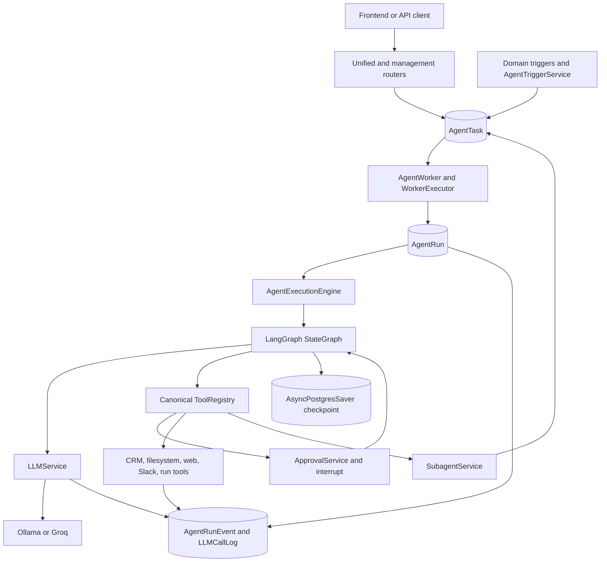
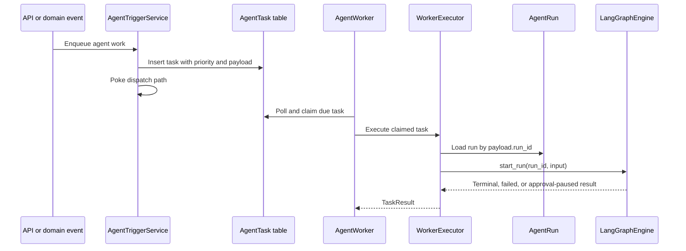
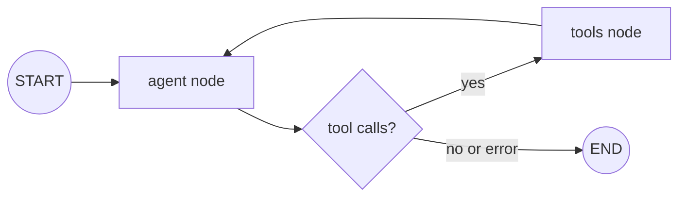
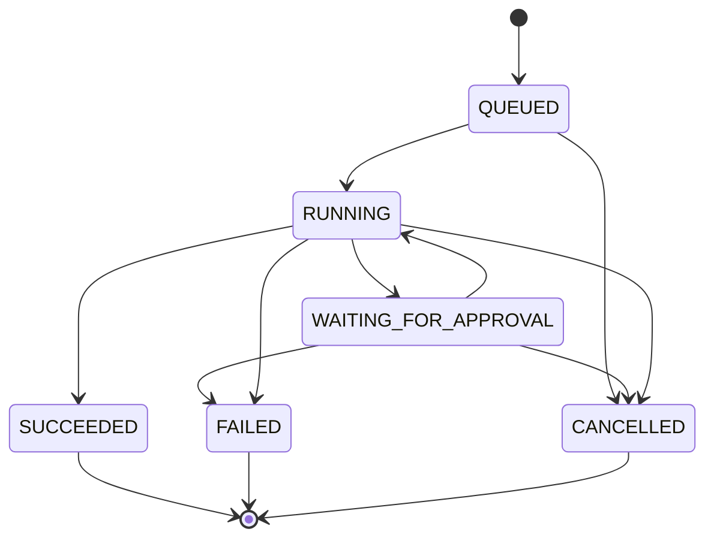
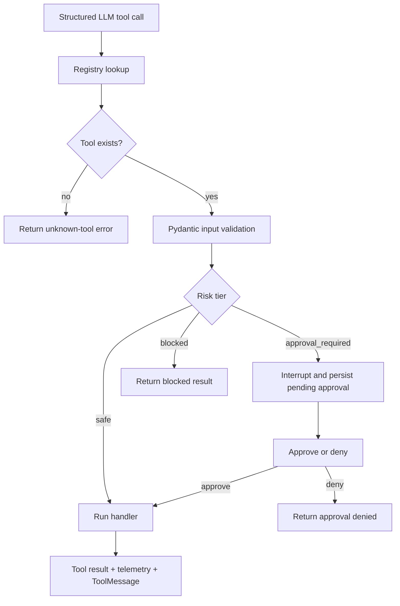
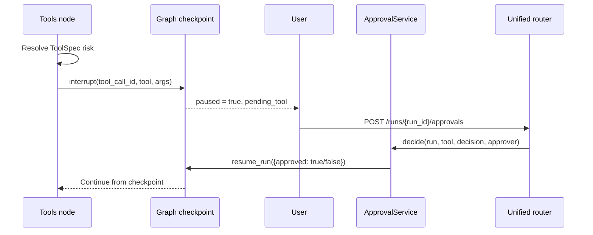
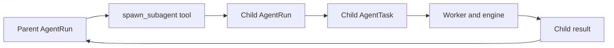

# Agentic Layer
## Durable CRM Agent Runtime

This document describes the agentic layer in `/home/suri/proj/crm/backend`: how requests become durable runs, how LangGraph reasons and loops over tools, how approvals and subagents work, how LLM providers are normalized, and how results are persisted and returned to the frontend.

The agentic layer is implemented inside the FastAPI backend, but it has a distinct responsibility: it controls model-driven execution while the backend remains the authority for identity, authorization, persistence, and business data.

---

## 1. Agentic Layer Mission

The agentic layer turns a natural-language request or an automated CRM trigger into a controlled execution:

```text
Natural-language intent
  -> durable run
  -> checkpointed reasoning graph
  -> typed tool calls
  -> policy and approval gate
  -> verified tool result
  -> final response or artifact
```

It is responsible for:

- LLM interaction and provider normalization
- Structured native tool calling
- Agent state and graph transitions
- Tool discovery, validation, risk classification, and execution
- Durable run lifecycle and event history
- Human approval and resumable execution
- Worker dispatch for asynchronous runs
- Bounded subagent delegation
- Generated file tracking
- LLM, tool, run, and checkpoint telemetry

It is not responsible for replacing backend authentication or bypassing domain authorization.

---

## 2. Agentic Architecture



### Core implementation files

| Concern | File |
| --- | --- |
| Engine contract | `app/agent/engine.py` |
| LangGraph implementation | `app/agent/langgraph_engine.py` |
| LLM provider adapter | `app/agent/llm.py` |
| Tool catalog and dispatch | `app/agent/tools/registry.py` |
| CRM query tool | `app/agent/tools/crm_query.py` |
| Filesystem tools | `app/agent/tools/filesystem.py` |
| Web fetch/search tools | `app/agent/tools/web_fetch.py`, registry handlers |
| Durable lifecycle | `app/agent/run_lifecycle.py` |
| Worker and task execution | `app/agent/worker.py` |
| Triggers and queueing | `app/agent/trigger.py` |
| Approvals | `app/agent/approval.py` |
| Subagents | `app/agent/subagents.py` |
| Unified API | `app/agent/unified_router.py` |
| Management API | `app/agent/router.py` |

---

## 3. Entry Points

### Unified chat

`POST /api/agents/unified/chat` accepts:

- `message`
- optional `conversation_history`
- optional `context`
- optional `model`
- optional `task_id` for continuing a prior thread

The route:

1. Gets the authenticated current user.
2. Chooses an existing task/thread ID or creates a UUID.
3. Calls `engine.start_run(...)`.
4. Converts generated file paths into response file objects.
5. Returns `ChatResponse`.

The response can include:

- `response`
- `agent_used`
- `tools_called`
- `steps_executed`
- `files`
- `task_id`
- `status`
- `paused`
- `pending_tool`

### Agent management

`app/agent/router.py` exposes agent definition and run operations:

- List agents
- Read an agent
- Run an agent immediately
- Cancel a run
- Read run history
- Read tasks
- Pause, resume, archive, restore, delete, and dispatch agent definitions

### Internal dispatch

`app/agent/internal_router.py` exposes internal queue controls:

- `/internal/crm/dispatch`
- `/internal/crm/dispatch-health`
- `/internal/crm/agent-dispatch`
- `/internal/crm/builder-dispatch`
- `/internal/crm/cancel-run`

### Domain triggers

`AgentTriggerService` can enqueue work for:

- Company creation
- Contact creation
- Upcoming meetings
- Workspace changes
- Backfills
- Field backfills
- Deployed agent runs
- Builder conversations

Triggers create durable task rows and attempt to poke the dispatch mechanism.

---

## 4. Durable Queue and Worker Layer



### `AgentTask`

A task can contain:

- Agent ID
- Task kind
- Reason
- Priority
- Budget
- Due time
- Domain record references
- JSON payload
- `payload.run_id` for agent-run execution
- Completion and cancellation state

### Worker routing

`WorkerExecutor.execute(task)` routes by payload:

- If `payload.run_id` exists, load the `AgentRun` and call the canonical execution engine.
- Otherwise route the task to the legacy/bridge executor for non-agent CRM dispatch work.

This preserves compatibility between agent runs and older domain task flows.

### Current dispatch boundary

`AgentTriggerService` contains queueing behavior, but some `poke`, dispatch, and bridge paths remain incomplete or environment-dependent. The durable task and run data model exists even where external dispatch delivery still needs completion.

---

## 5. Engine Contract

`AgentExecutionEngine` defines the engine-neutral contract:

```python
class AgentExecutionEngine(ABC):
    async def start_run(...): ...
    async def resume_run(...): ...
    async def cancel_run(...): ...
    async def get_state(...): ...
```

### Contract meaning

- `start_run`: execute from initial input until terminal state or approval pause
- `resume_run`: continue a paused graph with an approval decision
- `cancel_run`: cancel queued, running, or approval-paused work
- `get_state`: retrieve persisted checkpointed execution state

The interface keeps API, workers, and future engine implementations independent from LangGraph-specific details.

---

## 6. LangGraph Execution Model

The current implementation uses a two-node state graph:



### `AgentState`

The graph state contains:

- `messages`: LangChain messages with `add_messages` accumulation
- `run_id`
- `agent_id`
- `version_id`
- `user_id`
- `iteration`
- `files`
- `error`
- `depth`

### Agent node

The agent node:

1. Stops if the state already contains an error.
2. Stops when `MAX_ITERATIONS` is reached.
3. Converts internal messages to provider wire format.
4. Calls `LLMService.chat(...)` with canonical tool schemas.
5. Converts structured provider calls into `AIMessage.tool_calls`.
6. Appends a normal `AIMessage` when the provider returns final content.
7. Increments the iteration counter.

### Tools node

The tools node:

1. Reads tool calls from the latest AI message.
2. Builds a `ToolContext` for the current run.
3. Resolves all approval gates before executing any tool.
4. Interrupts on approval-required tools.
5. Executes allowed calls through the registry.
6. Captures errors as tool results rather than killing the whole run.
7. Tracks generated file paths.
8. Emits a tool event.
9. Appends each result as a `ToolMessage`.
10. Returns to the agent node for the next reasoning step.

### Exactly-once approval behavior

Approval gates are resolved before tool execution because interrupted graph state updates can be discarded on resume. Gating first prevents already-executed tools from being repeated after an approval pause.

### Limits

- Default maximum iterations: `15`
- Configurable through `AGENT_MAX_ITERATIONS`
- Tool execution time setting: `AGENT_MAX_TOOL_SECONDS`
- Maximum subagent depth: `3`

---

## 7. Run Lifecycle and Event History



`app/agent/run_lifecycle.py` owns:

- Valid transition validation
- Status transition timestamps
- Terminal settlement
- Error codes and messages
- Ordered `AgentRunEvent` creation
- OpenTelemetry transition spans

### Lifecycle events

A status transition emits an event containing:

- Run ID
- Sequence number
- Event type
- Previous status
- New status
- Emission timestamp

This makes run history reconstructable after a crash or worker interruption.

---

## 8. LLM Provider Layer

`app/agent/llm.py` normalizes Ollama and Groq behind one async interface.

### `LLMService.chat(...)`

Inputs:

- Provider-neutral message list
- Optional model
- Maximum tokens
- Temperature
- Canonical tool schemas
- Agent ID
- Run ID

Output: `LLMResponse` containing:

- Text content
- Provider
- Model
- Input tokens
- Output tokens
- Cost estimate
- Error
- Structured `ToolCall` list

### Provider selection

```text
Explicit model
  -> select configured provider

No explicit model
  -> use Ollama when configured
  -> otherwise use Groq when a key exists
  -> if Ollama fails and Groq is configured, fall back to Groq
```

### Provider contract

The adapter uses native structured tool calls. It does not scrape tool calls from free-form response text in the canonical LangGraph path.

Every call is logged to `LLMCallLog` with provider, model, token, cost, agent, and run context.

---

## 9. Canonical Tool Registry

`app/agent/tools/registry.py` is the single source of truth for agent-callable tools.

Each `ToolSpec` contains:

- Tool name
- Description
- JSON-schema parameters
- Risk tier
- Async handler

The registry provides:

- `register(spec)`
- `get(name)`
- `list_tools()`
- `names()`
- `llm_schemas()`
- `execute(name, args, context)`

### Tool execution



### Risk tiers

- `safe`: can execute automatically within its scope
- `approval_required`: graph pauses before side effect
- `blocked`: must not execute

### `ToolContext`

Every handler receives run-scoped context:

- `user_id`
- `workspace_root`
- optional database session
- `run_id`
- current subagent `depth`
- engine-supplied `subagent_executor`

---

## 10. Current Tool Catalog

| Tool | Functionality | Risk or boundary |
| --- | --- | --- |
| `ask_question` | Ask the user for missing information | Safe pause/clarification |
| `query_crm` | Allow-listed CRM reads and aggregations | Read-only |
| `read_crm_record` | Read a record by ID and kind | Read-only |
| `create_crm_activity` | Add call, email, meeting, or note activity | Approval required |
| `finish_run` | Finish with summary and structured result | Safe |
| `inspect_run` | Inspect another run | Read-only |
| `read_file` | Read a workspace text file | Workspace-scoped |
| `glob` | List workspace files by pattern | Workspace-scoped |
| `grep` | Search workspace files | Workspace-scoped |
| `write_file` | Write a workspace artifact | Approval required |
| `web_search` | Search the web | Provider/configuration dependent |
| `web_fetch` | Fetch public HTTP/HTTPS content with SSRF checks | Constrained external access |
| `post_slack_message` | Send a Slack message | Approval required |
| `todo` | Record/update a run todo | Safe |
| `spawn_subagent` | Spawn a child agent run | Depth-limited |

### Allow-listed CRM queries

`query_crm` delegates to `app/agent/tools/crm_query.py`, which supports operations such as:

- `list_companies`
- `list_deals`
- `search_contacts`
- `search_companies`
- `deal_pipeline`
- `contact_timeline`
- `company_contacts`
- `deal_summary`

Unknown operations, missing required parameters, and unexpected parameters are rejected.

### Important mutation boundary

The canonical registry currently exposes CRM reads and activity creation, but it does not register a generic company/contact/deal field-update tool. Direct root-agent routes expose mutation-shaped operations such as `/api/agents/root/set_field_value`, but those are not automatically available to the canonical unified engine.

A unified agent must report this capability gap instead of claiming an unregistered CRM update occurred.

---

## 11. Human-in-the-Loop Approvals

### Approval flow



### Approval endpoints

- `GET /api/agents/unified/runs/{run_id}/approvals`
- `POST /api/agents/unified/runs/{run_id}/approvals`
- `POST /api/agents/unified/tasks/{task_id}/approve`

### Approval record

The approval response includes:

- Approval ID
- Run ID
- Tool call ID
- Tool name
- Tool arguments
- Approval status
- Approver ID
- Created and decision timestamps

### Safety invariant

All approval gates are resolved before any tool in the current batch executes. This prevents an already-executed side effect from being replayed when the graph resumes.

---

## 12. Subagent Delegation

`app/agent/subagents.py` manages durable parent/child relationships.



### Spawn behavior

1. Validate the target agent exists.
2. Require the target agent to be `LIVE`.
3. Create a child `AgentRun` with `parent_run_id`.
4. Create a durable child `AgentTask` with `payload.run_id`.
5. Append the child ID to the parent `child_run_ids` list.
6. Let the execution engine run the child.
7. Return the child result to the parent tool call.

### Constraints

- Maximum depth is `3`.
- A child is a durable run, not an in-memory callback.
- Parent and child relationships can be listed and queried.
- The subagent service owns relationship records; the engine owns execution.

---

## 13. Agentic Request Examples

### CRM research

Prompt:

> Find all contacts at Acme, summarize recent activity, and identify the likely renewal owner.

Expected handling:

1. Search companies.
2. Resolve the exact company.
3. Query company contacts.
4. Read contact timelines.
5. Optionally use constrained web research.
6. Produce evidence-backed analysis.
7. Do not mutate CRM data unless explicitly requested.

### Three-month sales report

Prompt:

> Create a sales report for the past three months with pipeline by stage, total value, win rate, and top deals.

Expected handling:

1. Resolve the date range.
2. Run allow-listed deal queries.
3. Aggregate and validate totals.
4. Draft the report.
5. Pause before `write_file` if saving an artifact.
6. Return the report summary and file path.

### Company pitch deck

Prompt:

> Create a pitch deck for Acme using CRM activity and company context from the past three months.

Expected handling:

1. Resolve Acme and the date range.
2. Query contacts, deals, and activity history.
3. Gather permitted external context.
4. Optionally delegate bounded research.
5. Draft the deck narrative.
6. Pause before writing the artifact.
7. Verify sources and dates.
8. Return the artifact and assumptions.

### Company email update

Prompt:

> Update Acme's details with their updated email ID: sales@acme.com.

Required safe behavior:

1. Search and resolve the company.
2. Read and display the current value.
3. Check authorization and ambiguity.
4. Use a registered approval-aware mutation tool.
5. Pause if required.
6. Write once.
7. Re-read and verify.
8. Return old value, new value, record ID, and run/audit ID.

Current status: the canonical registry does not yet expose a generic company field-update tool. The agent should explicitly report that limitation or use a separately authorized direct service path rather than fabricate success.

---

## 14. Frontend Integration

The frontend uses `src/lib/api.js` to call the agent endpoints and `UnifiedChatPage.jsx` to render the user experience.

### Chat request path

```text
UnifiedChatPage.jsx
  -> API wrapper
  -> POST /api/agents/unified/chat
  -> ChatResponse
  -> render response, trace, approval, pause, status, and files
```

### UI-visible agent state

The frontend can display:

- Text response
- Agent family used
- Tools called
- Number of execution steps
- Task/run ID
- Run status
- Paused state
- Pending approval tool and arguments
- Generated files

### Generated files

The runner router serves generated files under `/api/agents/runner/files/{file_path}`. The frontend must ensure downloads use the correct authenticated access pattern in production.

---

## 15. Security Model

### Authentication boundary

The agent endpoints use the backend `get_current_user` dependency. The agent receives the authenticated user ID through `AgentState` and `ToolContext`.

### Authorization boundary

The agent does not replace backend authorization. Tools that read or mutate CRM data must enforce:

- User identity
- Role permissions
- Record scope and ownership
- Workspace boundary
- Operation allow-list
- Approval policy for side effects

### Filesystem boundary

Filesystem tools are constrained to the configured agent workspace and must reject unsafe paths. Generated artifacts should be returned through controlled file-serving endpoints.

### Web boundary

`web_fetch` uses URL validation and response limits to reduce SSRF and resource-exhaustion risk.

### Execution boundary

The canonical runner tool set does not expose arbitrary Python or shell execution. This reduces the risk of model-authored code becoming an uncontrolled backend side effect.

---

## 16. Observability

### LLM spans

The LLM service records:

- Provider
- Model
- Tool count
- Agent ID
- Run ID
- Input tokens
- Output tokens
- Cost estimate
- Error state

### Tool spans

The registry records:

- Tool name
- Risk tier
- Success state
- Exceptions and unknown-tool errors

### Run spans and events

The lifecycle records:

- Run ID
- Status transition source
- Status transition destination
- Invalid transitions
- Error code and message
- Ordered event sequence

### Why this matters

A run can be inspected after failure or approval pause without relying on process-local memory. The database and checkpoint store provide an execution trail.

---

## 17. Failure and Recovery Behavior

### LLM failure

- The provider adapter returns an error response.
- The graph records the error in state.
- The run settles as failed unless recovery logic or retry is added at a higher layer.
- If configured, Groq can be used as fallback after Ollama failure.

### Tool failure

- The tool exception is converted into a structured error result.
- The run can continue so the agent can explain the failure or try a safe alternative.
- The tool span records failure state.

### Approval pause

- The graph interrupts before the side effect.
- The run enters `WAITING_FOR_APPROVAL`.
- The frontend displays the pending tool and arguments.
- Approval or denial resumes the same checkpointed run.

### Worker interruption

- The task and run remain durable.
- LangGraph state is stored in PostgreSQL.
- A worker can resume from the run checkpoint when the dispatch path retries or reclaims work.

### Cancellation

The engine contract supports cancellation for queued, running, and approval-paused runs. Full cancellation delivery and bridge behavior should be tested end to end in deployment.

---

## 18. Current Limitations and Roadmap

### Current limitations

- Generic CRM field mutation is not yet a canonical registry tool.
- Some direct agent routes and canonical registry tools are not the same surface.
- Some trigger dispatch and bridge methods remain stubs or environment-dependent.
- Some service methods return placeholder or synthetic responses.
- Web search is not configured in every environment.
- Generated file downloads need authenticated handling in the frontend.
- Frontend chat history is primarily held in React state.
- Frontend protected routes and token-expiration handling need strengthening.

### Recommended next capabilities

1. Register typed `update_crm_record` or `set_company_field` tools.
2. Connect those tools to `assert_can_mutate` and durable approval records.
3. Add per-agent tool allow-lists and workspace/data scopes.
4. Complete task leasing, retry, cancellation, and dispatch recovery.
5. Add artifact generators for CSV, PDF, slide, and chart outputs.
6. Add end-to-end tests for approval, resume, tool replay prevention, and worker recovery.
7. Align direct root/runner/builder UI routes with the canonical registry and backend router registration.

---

## 19. Agentic Design Invariants

1. The model proposes; typed tools execute.
2. Unknown tools fail closed.
3. CRM reads are allow-listed.
4. Side effects are risk-tiered.
5. Approval happens before execution, not after.
6. Paused runs resume from durable checkpoints.
7. Tool results return to the graph as structured messages.
8. Run status transitions are validated and evented.
9. Subagents are durable child runs with bounded depth.
10. The agent must report missing capabilities instead of fabricating success.
11. Backend authentication and authorization remain authoritative.
12. Every important action should be observable through spans, events, or persisted results.

---

## 20. Related Documentation

- [Backend layer](backend.md)
- [Combined architecture](agentic-layer-architecture.svg)
- [Agentic-only architecture](agentic-only-architecture.svg)
- [Prompt execution examples](agentic-prompt-execution-examples.svg)
- [Backend-only architecture](backend-only-architecture.svg)
- [Presentation overview](ppt.md)
