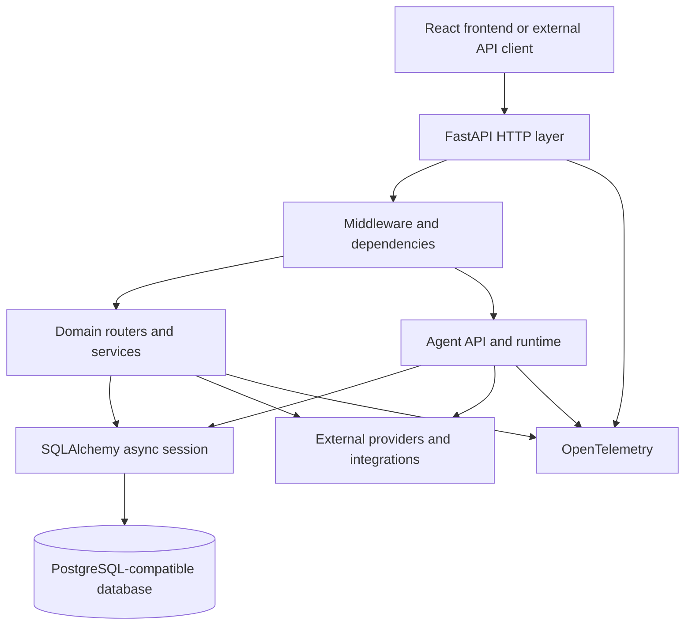
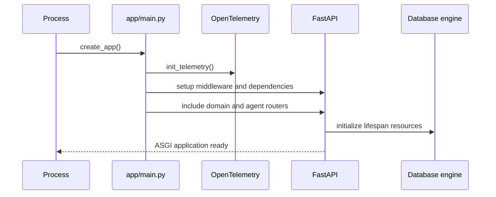
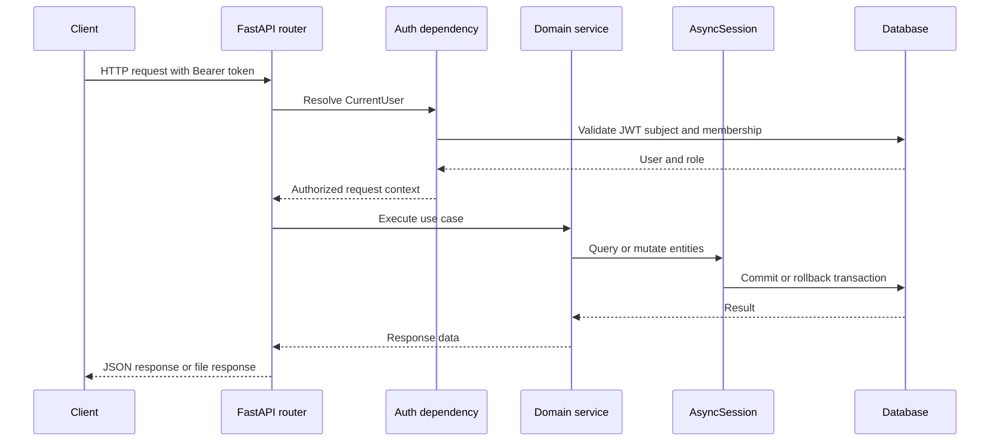

# Backend Layer
## FastAPI CRM Platform

This document describes the backend layer in `/home/suri/proj/crm/backend`: its layers, responsibilities, request flow, data model, authentication, CRM domains, integrations, operational concerns, and current implementation boundaries.

---

## 1. Backend Mission

The backend is the authoritative application boundary for:

- Identity and authentication
- Authorization and role-based access control
- CRM records and business rules
- Agent definitions, runs, tasks, approvals, and events
- Integration configuration and external service access
- Search, reporting inputs, enrichment, backfill, archive, and telemetry
- Durable persistence and API contracts for the frontend

The frontend is a client of this layer. A browser route or UI state must not be treated as an authorization boundary; backend dependencies remain authoritative.

---

## 2. Layered Architecture



### Layer responsibilities

| Layer | Main responsibility | Representative code |
| --- | --- | --- |
| HTTP/API | Routes, request parsing, response contracts, status codes | `app/*/router.py` |
| Cross-cutting | Auth, RBAC, middleware, logging, CORS, error handling | `app/dependencies`, `app/middlewares` |
| Domain/application | CRM and integration use cases | `app/*/service.py` |
| Agent boundary | Run creation, chat, approvals, agent management, dispatch | `app/agent/*.py` |
| Persistence | ORM models, sessions, migrations | `app/database`, `alembic` |
| External systems | LLMs, web, Slack, Google, Microsoft, mailbox, sync | `app/google`, `app/microsoft`, `app/slack`, `app/mailbox`, `app/sync` |
| Observability | HTTP, SQL, provider, tool, and run tracing | `app/telemetry`, `app/agent/run_lifecycle.py` |

---

## 3. Application Startup

### Entrypoint

`app/main.py` creates the FastAPI application and registers the router graph.

Startup responsibilities:

1. Initialize OpenTelemetry.
2. Create the FastAPI application with lifespan handling.
3. Configure middleware and shared dependencies.
4. Register authentication and CRM routers.
5. Register integration and administration routers.
6. Register agent routers, including unified chat, root, runner, internal dispatch, and LLM routes.
7. Instrument FastAPI requests.
8. Initialize database metadata in the current development setup.



### Configuration

`app/config/settings.py` loads environment-backed settings, including:

- `DATABASE_URL`, `DIRECT_URL`
- `SECRET_KEY` through `BETTER_AUTH_SECRET`
- `APP_URL`, `API_URL`, `BETTER_AUTH_URL`
- `REDIS_URL`
- `OLLAMA_BASE_URL`, `OLLAMA_MODEL`
- `GROQ_API_KEY`, `GROQ_MODEL`
- `AGENT_WORKSPACE_ROOT`
- `AGENT_MAX_ITERATIONS`, `AGENT_MAX_TOOL_SECONDS`
- `WEB_FETCH_TIMEOUT_SECONDS`, `WEB_FETCH_MAX_BYTES`
- `AUTH_DEV_MODE`, `ALLOWED_SIGN_IN`
- Integration credentials and telemetry settings

---

## 4. HTTP and Cross-Cutting Layer

### API conventions

- FastAPI routers define resource-specific endpoints.
- Pydantic schemas validate request and response data.
- Async route handlers use SQLAlchemy async sessions and async HTTP clients.
- Authentication is applied through `Depends(get_current_user)` where required.
- API responses are JSON unless an endpoint explicitly returns a generated file.

### Authentication

`app/auth/router.py` exposes:

- `POST /api/auth/sign-in`
- `POST /api/auth/sign-up`
- `GET /api/auth/me`
- `POST /api/auth/sign-out`
- `GET /api/auth/settings`
- `POST /api/auth/verify`

`app/auth/service.py`:

- Finds users by email.
- Verifies PBKDF2-SHA256 password hashes.
- Issues HS256 JWT tokens with a 24-hour session lifetime.
- Provides password hashing for user creation flows.

`app/dependencies/auth.py`:

- Accepts an HTTP Bearer token.
- Decodes and verifies the JWT using `SECRET_KEY`.
- Loads the user from the database.
- Resolves the primary role from `Member.role`.
- Fails closed for missing, invalid, expired, or unknown tokens.
- Supports an explicit development-only email allow-list when `AUTH_DEV_MODE` is enabled.

### Roles

```text
readonly < rep < manager < owner/admin
```

Authorization helpers include:

- `get_current_user`
- `require_role(...)`
- `assert_can_mutate(...)`

Mutation rules are role-aware. Owners and managers can mutate; representatives can mutate permitted records they own; readonly users are rejected.

### Middleware and dependencies

The backend contains middleware/dependency surfaces for:

- Authentication
- CORS
- Request logging
- General logging
- Error handling
- Pagination
- Caching
- RBAC
- Current-user access
- FastAPI, SQLAlchemy, and HTTPX instrumentation

---

## 5. Domain Layer

Most domain packages follow this shape:

```text
app/<domain>/
  router.py       HTTP endpoints
  service.py      application and business operations
  models.py       local persistence models where present
  schemas.py      request and response schemas
  contracts.py    shared contracts where present
```

### CRM core domains

#### Companies

Owns company records and company-level workflows:

- Name, domain, website, descriptions, logos, industry, location, and contact details
- Owner and primary-contact relationships
- Lifecycle stage and lead status
- Record source, activity timestamps, archive state, enrichment status
- Custom fields and field values
- Related contacts, deals, activities, messages, calendar events, and attachments

Representative package: `app/companies/`.

#### Contacts

Owns people and contact relationships:

- Name, email, phone, job title, seniority, function
- Company and owner relationships
- Lifecycle and lead status
- Social profiles and profile photo
- Enrichment and activity metadata
- Custom fields, attachments, email threads, and calendar events

Representative package: `app/contacts/`.

#### Deals

Owns sales pipeline state:

- Deal name and company relationship
- Owner, amount, currency, and expected close date
- Deal stage and stage-change timestamps
- Forecast category
- Closed-won and closed-lost state
- Deal contacts and activities

Representative package: `app/deals/`.

#### Activities

Represents CRM interaction history:

- Notes
- Calls
- Emails
- Meetings
- Tasks
- Stage changes
- Lifecycle changes
- Enrichment events

Representative package: `app/activities/`.

#### Conversations

Stores CRM-linked conversations and conversation context.

Representative package: `app/conversations/`.

### Organization and data management

- `app/fields/`: custom field definitions and values
- `app/saved_views/`: saved filters and views
- `app/search/`: cross-entity search
- `app/archive/`: archive and restore behavior
- `app/currency/`: currency configuration and reporting currency
- `app/backfill/`: batch backfill and enrichment jobs
- `app/crm/`: shared CRM helpers, bulk operations, activity stamps, and enrichment logs

### Administration

- `app/workspace/`: workspace configuration and profile
- `app/users/`: users and membership-facing operations
- `app/settings/`: settings
- `app/api_keys/`: API key lifecycle
- `app/tracking/`: tracking configuration and events
- `app/telemetry/`: telemetry configuration and records
- `app/cache/`: cache operations
- `app/dashboard/`: dashboard-facing aggregation endpoints

---

## 6. Integrations Layer

The backend exposes configuration and operation surfaces for:

- `app/slack/`: Slack connection and messaging integration
- `app/sso/`: SSO configuration
- `app/mailbox/`: mailbox connection and mail workflows
- `app/google/`: Google integration
- `app/microsoft/`: Microsoft integration
- `app/sync/`: synchronization workflows
- `app/enrichment/`: enrichment services and records
- `app/google/` and `app/microsoft/`: provider-specific integrations
- `app/telemetry/`: observability and operational data

External access should remain behind service boundaries rather than being performed directly by route handlers wherever possible.

---

## 7. Persistence and Database Layer

### Sessions

`app/database/session.py` provides:

- Async SQLAlchemy engine
- `async_sessionmaker`
- Declarative `Base`
- Async database dependency
- Commit, rollback, and close handling

### ORM model groups

`app/database/models.py` contains shared models for:

- Users and members
- Companies, contacts, deals, and activities
- Conversations and communication records
- Agent definitions and versions
- Agent triggers, runs, tasks, events, actions, and approvals
- LLM call logs and builder artifacts
- Workspace and custom-field state

### Migrations

Alembic migration files live under:

```text
alembic/
  env.py
  script.py.mako
  versions/
```

Migrations provide versioned schema changes for agent approval, run input, subagent relationships, and other runtime features.

### Database request flow

```text
HTTP route
  -> dependency creates AsyncSession
  -> service executes SQLAlchemy query or mutation
  -> transaction commits on success
  -> transaction rolls back on error
  -> response schema serializes result
```

---

## 8. Agent API Boundary

The agent API is part of the backend but is described separately in [agentic.md](agentic.md).

### Public agent routes

`app/agent/router.py`:

- `GET /api/agents/`
- `GET /api/agents/{agent_id}`
- `POST /api/agents/{agent_id}/run`
- `POST /api/agents/{agent_id}/runs/{run_id}/cancel`
- `GET /api/agents/{agent_id}/history`
- `GET /api/agents/{agent_id}/tasks`
- Agent pause, resume, archive, restore, delete, and dispatch operations

`app/agent/unified_router.py`:

- `POST /api/agents/unified/chat`
- `POST /api/agents/unified/tasks/{task_id}/approve`
- `GET /api/agents/unified/runs/{run_id}/approvals`
- `POST /api/agents/unified/runs/{run_id}/approvals`

`app/agent/internal_router.py`:

- `POST /internal/crm/dispatch`
- `GET /internal/crm/dispatch-health`
- `POST /internal/crm/agent-dispatch`
- `POST /internal/crm/builder-dispatch`
- `POST /internal/crm/cancel-run`

### Direct agent family routes

- `/api/agents/root/...`: direct CRM research, enrichment, field, contact, and brief operations
- `/api/agents/runner/...`: generated file serving and runner-facing surfaces
- `/api/agents/llm/...`: LLM status and provider-facing endpoints

The direct family routes and canonical LangGraph execution path coexist. A direct route is not automatically a canonical registry tool.

---

## 9. Request Lifecycle



### Agent request variation

```text
Client
  -> unified agent route
  -> AgentRun and AgentTask persistence
  -> worker and agentic runtime
  -> tools or approval
  -> durable result
  -> ChatResponse
```

---

## 10. Observability and Operations

OpenTelemetry spans are used across:

- FastAPI requests
- SQLAlchemy database operations
- HTTPX external requests
- LLM calls
- Tool execution
- Run lifecycle transitions

Important run attributes include:

- `run.id`
- `run.from`
- `run.to`
- LLM provider and model
- Input and output token counts
- Estimated cost
- Tool name and risk
- Tool success state

Operational endpoints include health, dispatch health, telemetry, cache, tracking, and run history surfaces.

---

## 11. Testing and Tooling

Backend configuration:

- Python `>=3.11`
- Pytest and pytest-asyncio
- Async test mode enabled
- Test discovery under `tests/`
- HTTPX test client support
- Coverage support through pytest-cov

Important test themes:

- CRM CRUD and domain behavior
- Authentication
- Agent root and runner surfaces
- Tool registry behavior
- SSRF protection
- CRM query allow-listing
- Agent run and approval behavior
- LangGraph engine behavior

---

## 12. Current Limitations

The following boundaries should be stated clearly when presenting the backend:

- Some service methods still return placeholders or synthetic responses.
- Dispatch bridge methods exist but some paths are still stubs or incomplete.
- The frontend currently exposes builder routes that must remain aligned with backend router registration.
- A generic CRM mutation tool is not currently registered in the canonical agent `ToolRegistry`, although direct root-agent mutation endpoints exist.
- Frontend route protection and token-expiration handling need strengthening; backend auth remains the enforcement boundary.
- Development database metadata creation is present in lifespan code; production deployments should use controlled migrations.

---

## 13. Backend Design Principles

1. Keep authentication and authorization in the backend.
2. Keep domain rules inside services and typed contracts.
3. Keep persistence transactional and explicit.
4. Keep integrations behind dedicated modules.
5. Keep agent side effects behind canonical, policy-aware tools.
6. Emit enough events and telemetry to reconstruct behavior.
7. Return explicit capability errors instead of fabricated success.
8. Preserve a clean boundary between direct legacy routes and the durable agent runtime.
