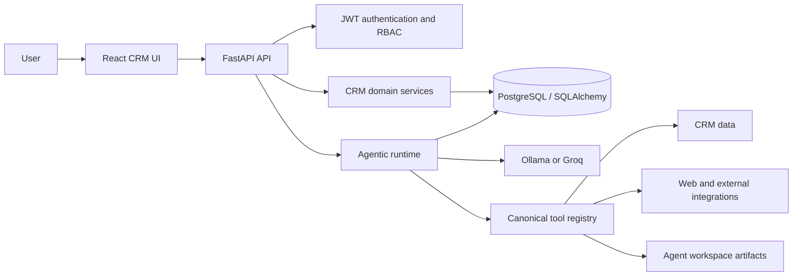
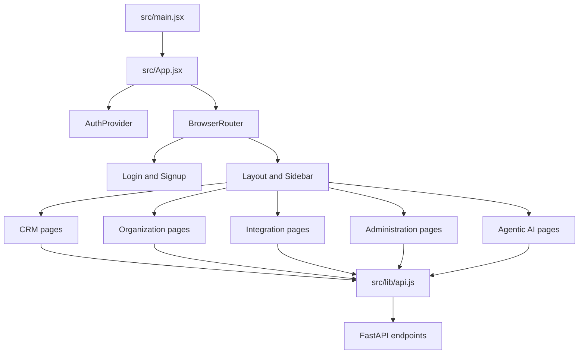
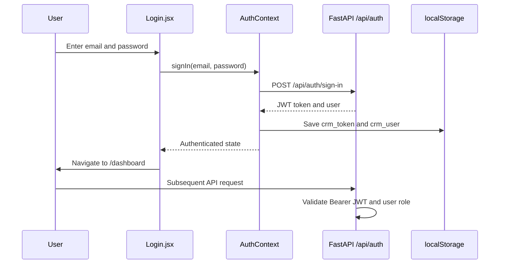
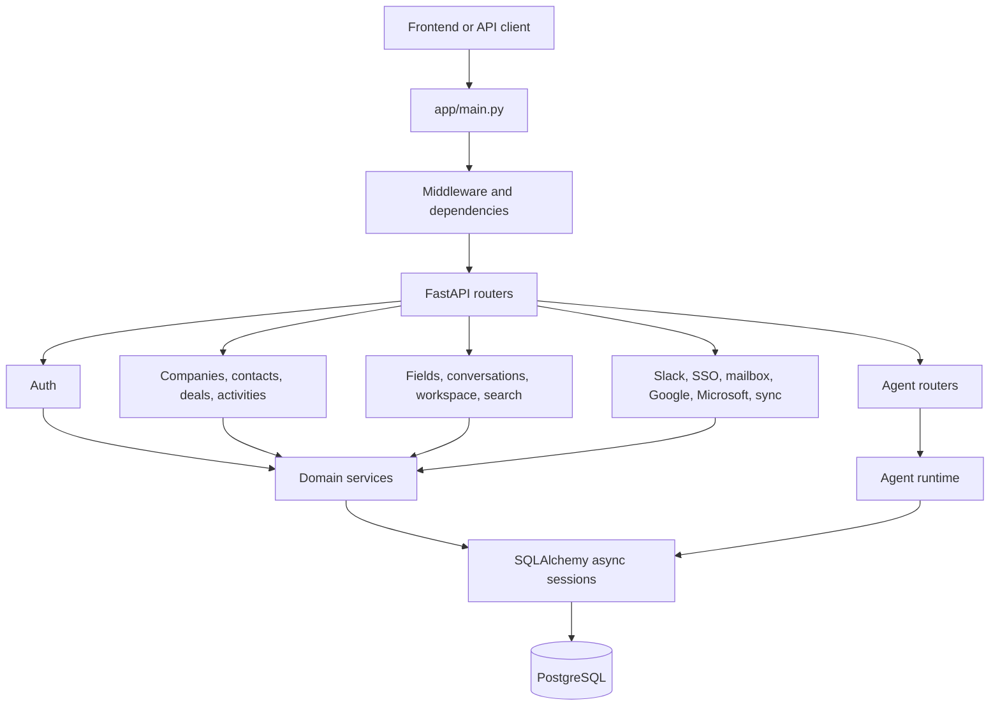
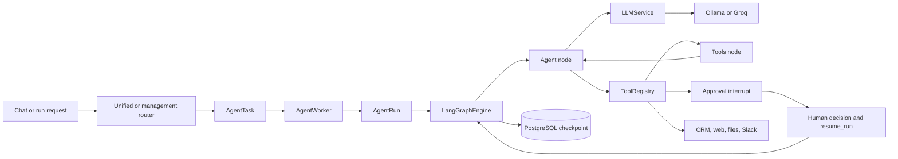
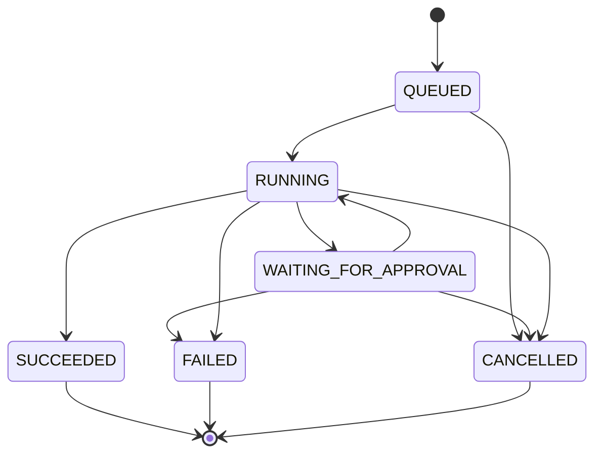
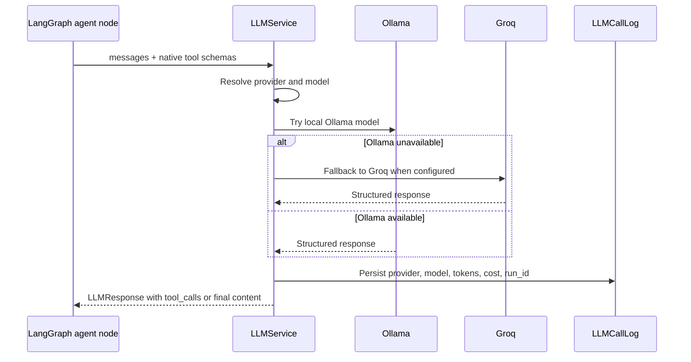
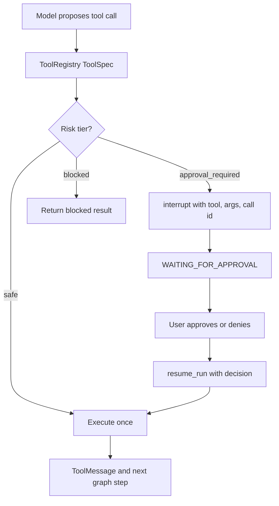
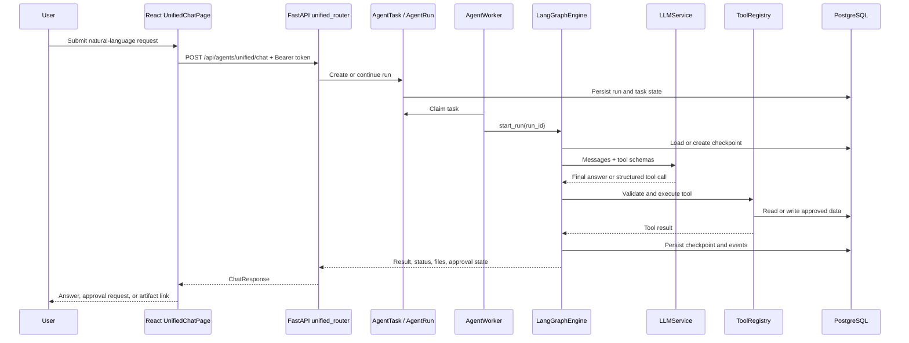

# Agentic CRM Platform
## Frontend, Backend, and Agentic Architecture

> Presentation source prepared from the current repositories:
> - `/home/suri/proj/crm/backend`
> - `/home/suri/proj/crm/ownstuff/Agentic_crm_frontend/crm-ui`
>
> Status: implementation-oriented overview. Where behavior is incomplete or still represented by a stub, it is called out explicitly.

---

## Slide 1: Product Overview

### Agentic CRM

A full-stack CRM platform with:

- CRM management for companies, contacts, deals, activities, and conversations
- Search, saved views, custom fields, archive, currency, and backfill workflows
- Workspace, users, settings, API keys, telemetry, tracking, and cache administration
- Integrations for Slack, SSO, mailbox, Google, Microsoft, sync, and enrichment workflows
- Agentic AI for CRM research, analysis, enrichment, reporting, file generation, and guided actions
- Durable agent runs with checkpointing, approval gates, event history, and subagent delegation

### Core value

The platform combines structured CRM workflows with natural-language agent workflows while preserving typed APIs, authorization boundaries, tool policies, and durable execution.

---

## Slide 2: System at a Glance



### Three architectural boundaries

1. **Frontend:** browser application, navigation, forms, chat, dashboards, and API client.
2. **Backend:** FastAPI routes, authentication, domain services, database models, integrations, and operational APIs.
3. **Agentic layer:** durable runs, LangGraph state, LLM calls, tools, approvals, worker dispatch, and subagents.

---

## Slide 3: Technology Stack

| Area | Technology | Role |
| --- | --- | --- |
| Frontend runtime | React 19 | Component-based browser UI |
| Frontend build | Vite 8 | Development server and production build |
| Frontend routing | React Router DOM 7 | URL-based application navigation |
| Frontend styling | Tailwind CSS 4, PostCSS | Utility styling and responsive UI |
| Frontend icons | lucide-react | Consistent icon system |
| Backend API | FastAPI | Async HTTP API and dependency injection |
| Backend server | Uvicorn | ASGI application server |
| Persistence | SQLAlchemy 2 async | ORM and database access |
| Database migrations | Alembic | Schema migration workflow |
| Database | PostgreSQL-compatible database | CRM, agent, event, and audit persistence |
| Validation | Pydantic 2 | Request, response, and tool schemas |
| Authentication | JWT via `python-jose` | Signed bearer sessions |
| Agent orchestration | LangGraph | Checkpointed state graph and resumable runs |
| Checkpointing | `langgraph-checkpoint-postgres` | PostgreSQL-backed graph state |
| HTTP integrations | HTTPX | Providers and external services |
| LLM providers | Ollama and Groq | Local/fallback model execution |
| Observability | OpenTelemetry | FastAPI, SQLAlchemy, HTTPX, LLM, tool, and run traces |
| Testing | Pytest, pytest-asyncio, frontend build/lint | Regression and build checks |

### Primary configuration files

- Frontend: `ownstuff/Agentic_crm_frontend/crm-ui/package.json`, `vite.config.js`, `src/index.css`
- Backend: `pyproject.toml`, `requirements.txt`, `app/config/settings.py`

---

## Slide 4: Frontend Architecture



### Frontend responsibilities

- Render the CRM workspace and navigation shell
- Maintain page-level loading, error, and response state
- Collect form inputs and send typed JSON requests
- Persist the current token and user snapshot in browser local storage
- Render agent conversations, tool traces, approval states, run identifiers, and generated files
- Provide administrative and integration configuration surfaces

### Important frontend files

- `src/main.jsx`: React entrypoint
- `src/App.jsx`: route map and layout composition
- `src/components/Layout.jsx`: authenticated application shell
- `src/components/Sidebar.jsx`: grouped navigation
- `src/context/AuthContext.jsx`: token, user, sign-in, sign-up, sign-out state
- `src/lib/api.js`: centralized `fetch` wrapper and API namespaces
- `src/pages/UnifiedChatPage.jsx`: unified agent experience
- `src/pages/AgentsPage.jsx`: agent catalog and management
- `src/pages/AIChatPage.jsx`: basic LLM chat

---

## Slide 5: Frontend Route Map

### Public routes

- `/` - Login
- `/signup` - Registration

### Core CRM routes

- `/dashboard`
- `/companies`
- `/contacts`
- `/deals`
- `/activities`
- `/conversations`

### Organization and data-management routes

- `/fields`
- `/saved-views`
- `/search`
- `/archive`
- `/currency`

### Integration routes

- `/slack`
- `/sso`
- `/sync`
- `/mailbox`
- `/google`
- `/microsoft`
- `/backfill`

### Administration routes

- `/workspace`
- `/users`
- `/settings`
- `/api-keys`
- `/tracking`
- `/telemetry`
- `/cache`

### Agentic routes

- `/agents`
- `/agents/root`
- `/agents/builder`
- `/agents/runner`
- `/agents/chat`
- `/agents/unified`

### Current frontend auth caveat

`App.jsx` does not currently wrap application routes in a protected-route component. The backend remains the primary authorization boundary. The frontend stores `crm_token` and `crm_user` in local storage, but it does not visibly validate the token on startup with `/api/auth/me`.

---

## Slide 6: Frontend Authentication Flow



### Backend authentication behavior

- `app/auth/router.py` exposes sign-in, sign-up, `/me`, and sign-out endpoints.
- `app/auth/service.py` verifies PBKDF2-SHA256 password hashes and issues HS256 JWTs.
- `app/dependencies/auth.py` validates the JWT subject against the `User` table.
- Roles are resolved from `Member.role` and represented by a role hierarchy.
- Supported role levels include `readonly`, `rep`, `manager`, `owner`, and `admin`.

### Current implementation note

The frontend has a development/demo fallback that creates a local `demo-token-*` when sign-in fails. This is convenient for offline UI work but should be removed or disabled for production because it can mask real authentication failures.

---

## Slide 7: Backend Application Architecture



### Backend startup

`app/main.py`:

1. Initializes OpenTelemetry.
2. Creates the FastAPI application.
3. Installs middleware and shared dependencies.
4. Registers authentication, CRM, integration, administrative, and agent routers.
5. Instruments FastAPI requests.
6. Creates database metadata on application lifespan startup in the current development setup.

### Backend conventions

Most domain packages follow a recognizable structure:

```text
app/<domain>/
  router.py       HTTP endpoints
  service.py      application/domain operations
  models.py       persistence models where local
  schemas.py      request and response schemas
  contracts.py    shared contracts where present
```

The project also has shared database models in `app/database/models.py` and shared sessions in `app/database/session.py`.

---

## Slide 8: Backend Domain Modules and Features

### CRM core

- **Companies:** company records, domains, ownership, lifecycle, enrichment metadata
- **Contacts:** people, contact details, company relationships, lifecycle, enrichment
- **Deals:** pipeline stages, amount, currency, ownership, close dates, forecast categories
- **Activities:** notes, calls, emails, meetings, tasks, stage changes, enrichment events
- **Conversations:** conversation records and CRM-linked discussion context

### Data organization

- **Fields:** custom field definitions and values
- **Saved views:** reusable filtered views
- **Search:** cross-entity search
- **Archive:** archive and restore records
- **Currency:** supported currencies and reporting currency
- **Backfill:** batch enrichment or field backfill workflows

### Administration

- **Workspace:** workspace configuration and profiles
- **Users:** users and membership administration
- **Settings:** application settings
- **API keys:** API key lifecycle
- **Tracking, telemetry, cache:** operational configuration and visibility

### Integrations

- Slack
- SSO
- Mailbox
- Google
- Microsoft
- Sync
- Enrichment and web research services

---

## Slide 9: Backend Data and Persistence Model

```mermaid
erDiagram
    USER ||--o{ MEMBER : has
    USER ||--o{ COMPANY : owns
    USER ||--o{ CONTACT : owns
    USER ||--o{ DEAL : owns
    COMPANY ||--o{ CONTACT : contains
    COMPANY ||--o{ DEAL : has
    COMPANY ||--o{ ACTIVITY : records
    CONTACT ||--o{ ACTIVITY : records
    AGENT_DEFINITION ||--o{ AGENT_VERSION : versions
    AGENT_DEFINITION ||--o{ AGENT_RUN : executes
    AGENT_RUN ||--o{ AGENT_RUN_EVENT : emits
    AGENT_DEFINITION ||--o{ AGENT_TASK : queues
    AGENT_RUN ||--o{ AGENT_APPROVAL : pauses

    USER { string id PK; string email; string name }
    COMPANY { string id PK; string name; string domain; string owner_id FK }
    CONTACT { string id PK; string email; string company_id FK }
    DEAL { string id PK; string stage; float amount; string company_id FK }
    AGENT_DEFINITION { string id PK; string status; string current_version_id FK }
    AGENT_VERSION { string id PK; string agent_id FK; int number }
    AGENT_RUN { string id PK; string status; json input; json result }
    AGENT_RUN_EVENT { string id PK; string run_id FK; int sequence; string type }
    AGENT_TASK { string id PK; string kind; int priority; json payload }
    AGENT_APPROVAL { string id PK; string run_id FK; string status }
```

### Agent persistence responsibilities

- `AgentDefinition`: deployable agent identity and status
- `AgentVersion`: versioned instructions, model, manifest, and policy data
- `AgentRun`: one execution, including input, result, status, timestamps, and errors
- `AgentTask`: durable queue item claimed by a worker
- `AgentRunEvent`: ordered status and execution history
- `AgentApproval`: durable human decision record
- `LLMCallLog`: provider, model, tokens, cost, and run association
- LangGraph checkpoints: durable graph state keyed by `graph_thread_id = run_id`

---

## Slide 10: Agentic Layer Overview



### Agentic layer responsibilities

- Convert user intent into structured model messages and tool calls
- Expose a canonical tool catalog to the LLM
- Route every tool invocation through typed schemas and handlers
- Classify tools by risk: safe, approval-required, or blocked
- Pause before side effects and resume from a durable checkpoint
- Persist run state, status transitions, tool events, LLM calls, results, and errors
- Spawn bounded child runs for subagent work
- Return a final answer plus generated files, tool names, status, and pause metadata

---

## Slide 11: Durable Agent Run Lifecycle



### Execution sequence

1. A chat request or domain event creates or identifies a run.
2. A durable `AgentTask` is inserted with `payload.run_id`.
3. `AgentTriggerService` pokes the dispatch path.
4. `AgentWorker` claims work and `WorkerExecutor` routes agent runs to the engine.
5. `LangGraphEngine.start_run()` transitions the run to `RUNNING`.
6. The graph calls the LLM and receives structured tool calls.
7. Approval-required tools interrupt before execution.
8. Safe tools execute through `ToolRegistry`.
9. Tool results return to graph state as `ToolMessage` values.
10. The loop repeats until a final response, iteration limit, failure, or cancellation.
11. The run settles and records its summary/result.

### Durability properties

- PostgreSQL-backed queue and run records
- Ordered run events
- LangGraph checkpoint resume after interruption or approval
- Maximum iteration limit controlled by `AGENT_MAX_ITERATIONS`
- Maximum subagent nesting depth of 3
- Tool execution spans and LLM call logs

---

## Slide 12: Canonical Tool Registry

The registry is the single source of truth for tool names, JSON schemas, risk tiers, and handlers.

### Current tool categories

| Category | Tools or operations | Typical risk |
| --- | --- | --- |
| Conversation | `ask_question`, `todo`, `finish_run` | Safe |
| CRM read | `query_crm`, `read_crm_record`, `inspect_run` | Safe / allow-listed |
| CRM activity | `create_crm_activity` | Approval required |
| Workspace | `read_file`, `glob`, `grep` | Safe within workspace |
| Workspace write | `write_file` | Approval required |
| Web | `web_search`, `web_fetch` | Safe but constrained |
| Messaging | `post_slack_message` | Approval required |
| Delegation | `spawn_subagent` | Depth-limited |

### Tool execution contract

```text
LLM tool call
  -> ToolRegistry.get(name)
  -> validate tool arguments with Pydantic schema
  -> inspect risk tier
  -> interrupt if approval_required
  -> execute handler with ToolContext
  -> capture result and telemetry
  -> append ToolMessage to graph state
```

### Security boundary

The tool handler receives `ToolContext`, including:

- `user_id`
- `run_id`
- workspace context
- database session when provided
- subagent depth
- engine-provided subagent executor

Unknown tools and unsupported CRM query operations are rejected instead of being executed as arbitrary code.

---

## Slide 13: LLM and Model Integration



### Current provider settings

- `OLLAMA_BASE_URL`, default `http://localhost:11434`
- `OLLAMA_MODEL`, default `llama3.1`
- `GROQ_API_KEY`
- `GROQ_MODEL`, default `llama-3.1-70b-versatile`

The adapter normalizes provider responses into `LLMResponse` and `ToolCall` objects. The agent engine does not need to know the provider wire format.

---

## Slide 14: Human-in-the-Loop Approval

### Why approvals exist

The agent may reason about an action, but reasoning alone must not authorize a side effect. Tools such as file writes, Slack messages, and CRM activities are risk-tiered.



### Approval API

- `GET /api/agents/unified/runs/{run_id}/approvals`
- `POST /api/agents/unified/runs/{run_id}/approvals`
- `POST /api/agents/unified/tasks/{task_id}/approve`

The approval record includes the run, tool call ID, tool name, arguments, status, approver, and decision time.

---

## Slide 15: Frontend Agentic Experience

### Agent catalog

The frontend exposes pages for:

- Agent list and lifecycle actions
- Root agent CRM workflows
- Builder workflows for files and agent artifacts
- Runner workflows for analysis and execution
- Basic LLM chat
- Unified chat

### Unified chat capabilities

- Natural-language request entry
- Conversation history in the active React session
- Agent/model selection
- Tool-call trace display
- Run ID and status display
- Approval decision controls
- Paused-run continuation
- Generated image/PDF/file result links
- Telemetry/tracing display where provided by the API

### Frontend integration shape

```text
UnifiedChatPage.jsx
  -> API helper in src/lib/api.js
  -> POST /api/agents/unified/chat
  -> ChatResponse
       response
       agent_used
       tools_called
       steps_executed
       task_id
       status
       paused
       pending_tool
  -> render answer, trace, approval, or files
```

---

## Slide 16: Example Usage 1 - CRM Research

### User prompt

> "Find all contacts at Acme, summarize their recent activity, and identify the person most likely to own the renewal."

### Agent handling

1. Parse company name and business goal.
2. Call `query_crm(search_companies)` to resolve Acme.
3. Call `query_crm(company_contacts)` for associated contacts.
4. Inspect contact timelines and recent activities.
5. If external research is requested, use constrained `web_search` or `web_fetch`.
6. Produce a grounded summary with evidence and uncertainty.
7. Do not change CRM records unless the user asks for a write action.

### Output

- Candidate contact list
- Activity evidence
- Reasoned recommendation
- Explicit missing-data notes
- No approval required for read-only analysis

---

## Slide 17: Example Usage 2 - Sales Report

### User prompt

> "Create a sales report for the past three months with pipeline by stage, total value, win rate, and the top deals."

### Agent handling

1. Resolve the date range explicitly.
2. Run allow-listed CRM queries such as `deal_pipeline` and `list_deals`.
3. Aggregate totals and explain calculation assumptions.
4. Validate totals against source query results.
5. Draft the report.
6. If writing a report file, request approval for `write_file`.
7. Return the summary and generated artifact path.

### Example response shape

```json
{
  "period": "2026-07-01 to 2026-10-07",
  "pipeline_by_stage": [],
  "top_deals": [],
  "assumptions": [],
  "artifact": "agent_workspace/sales-report.md"
}
```

The agent must say when data is missing or a requested metric cannot be computed from the available allow-listed operations.

---

## Slide 18: Example Usage 3 - Company Pitch Deck

### User prompt

> "Create a pitch deck for Acme using CRM activity and company context from the past three months."

### Agent handling

1. Resolve the company record.
2. Define the three-month time window.
3. Query company contacts, deals, and activity history.
4. Gather permitted public context with `web_search` and `web_fetch`.
5. Optionally delegate bounded research to a child agent with `spawn_subagent`.
6. Draft slide sections: company situation, current relationship, pain points, value proposition, proof points, next steps.
7. Request approval before writing the deck artifact.
8. Verify source dates and distinguish CRM facts from external assumptions.
9. Return the deck file and a concise evidence summary.

### Guardrails

- No invented company facts
- Source and date attached to research claims
- Explicit assumptions and missing data
- File write is approval-gated
- Subagent depth is limited

---

## Slide 19: Example Usage 4 - Company Email Update

### User prompt

> "Update Acme's details with their updated email ID: sales@acme.com."

### Intended safe flow

1. Search for the company and resolve ambiguous matches.
2. Read the current record and show the old value.
3. Check the user's authorization to mutate that record.
4. Ask for confirmation if the target or new value is ambiguous.
5. Invoke a registered, typed, approval-aware CRM mutation tool.
6. Pause for approval if required by policy.
7. Update the record exactly once.
8. Re-read the record and verify the new email.
9. Return old value, new value, record ID, and audit/run ID.

### Current repository status

- The direct root-agent router exposes field mutation behavior such as `/api/agents/root/set_field_value`.
- The canonical `ToolRegistry` currently exposes CRM reads and activity creation, but not a generic company-email mutation tool.
- Therefore the canonical unified agent should not claim the email was updated until the mutation capability is registered and connected to authorization and approval policy.

This distinction is important: an agent should report a capability gap rather than fabricate success.

---

## Slide 20: End-to-End Request Example



---

## Slide 21: Security, Reliability, and Operational Controls

### Security

- Bearer JWT validation against the database user
- Role hierarchy and mutation authorization helpers
- Allow-listed CRM query operations
- Workspace-scoped filesystem tools
- SSRF-safe public web fetching
- Tool risk tiers and human approval
- No arbitrary Python or shell execution in the canonical runner tool set

### Reliability

- Durable `AgentTask` queue
- Explicit run state machine
- Event sequence for reconstructing history
- PostgreSQL-backed LangGraph checkpointing
- Resume after approval pause or worker interruption
- Iteration, tool-time, and subagent-depth limits

### Observability

- OpenTelemetry FastAPI instrumentation
- SQLAlchemy and HTTPX instrumentation
- LLM provider/model/token/cost attributes
- Tool spans with name, risk, and success
- Run transition spans and status events

---

## Slide 22: Current Gaps and Roadmap

### Frontend gaps

- Add a protected-route boundary that redirects unauthenticated users to `/`.
- Remove or feature-flag demo-token fallback outside local development.
- Validate stored tokens with `/api/auth/me` on startup.
- Handle expired tokens centrally in the API wrapper.
- Attach authentication when downloading generated runner files.
- Persist chat history beyond the current React session.

### Backend and agentic gaps

- Register an approval-aware CRM mutation tool for company/contact/deal updates.
- Align frontend builder routes with the backend routers actually registered in `app/main.py`.
- Complete placeholder service methods that return synthetic responses.
- Replace dispatch stubs with a fully operational bridge where required.
- Add stronger per-agent tool allow-lists and data-scope enforcement.
- Expand report/deck artifact generation beyond plain text workspace files.
- Add end-to-end tests for approval, resume, cancellation, and worker recovery.

### Architectural direction

Keep the canonical agent path centered on:

```text
Typed request -> durable run -> checkpointed graph -> canonical tool registry -> policy gate -> verified result
```

---

## Slide 23: Demonstration Plan

### Demo sequence

1. Sign in and open the dashboard.
2. Browse a company and inspect contacts, deals, and activities.
3. Open unified agent chat.
4. Ask for a three-month sales report.
5. Show CRM tool calls and read-only execution.
6. Ask the agent to save the report.
7. Show the approval pause for `write_file`.
8. Approve the write and open the generated artifact.
9. Ask for a company pitch deck.
10. Show CRM research, web context, evidence, and output artifact.
11. Ask for a company email update.
12. Show record resolution and the current mutation-capability boundary.
13. Open run history and show status events and run IDs.

### Success criteria

- The user can understand where the request goes.
- Every side effect is visible and policy-controlled.
- Generated outputs are linked back to a durable run.
- Missing capabilities are reported explicitly.
- Backend authorization remains authoritative even when the UI is bypassed.

---

## Slide 24: Reference Map

### Frontend

- `ownstuff/Agentic_crm_frontend/crm-ui/src/App.jsx`
- `ownstuff/Agentic_crm_frontend/crm-ui/src/context/AuthContext.jsx`
- `ownstuff/Agentic_crm_frontend/crm-ui/src/lib/api.js`
- `ownstuff/Agentic_crm_frontend/crm-ui/src/pages/UnifiedChatPage.jsx`
- `ownstuff/Agentic_crm_frontend/crm-ui/src/pages/AgentsPage.jsx`
- `ownstuff/Agentic_crm_frontend/crm-ui/package.json`

### Backend

- `app/main.py`
- `app/config/settings.py`
- `app/dependencies/auth.py`
- `app/auth/router.py`
- `app/auth/service.py`
- `app/database/models.py`
- `app/database/session.py`
- `app/agent/router.py`
- `app/agent/unified_router.py`
- `app/agent/worker.py`
- `app/agent/trigger.py`
- `app/agent/run_lifecycle.py`

### Agentic runtime

- `app/agent/engine.py`
- `app/agent/langgraph_engine.py`
- `app/agent/llm.py`
- `app/agent/tools/registry.py`
- `app/agent/tools/crm_query.py`
- `app/agent/subagents.py`
- `app/agent/approval.py`
- `agentic-only-architecture.svg`
- `agentic-prompt-execution-examples.svg`
- `backend-only-architecture.svg`

---

## Closing Message

The platform is not only a CRM UI with an LLM attached. It is a layered system:

- The **frontend** gives users a coherent CRM and agent workspace.
- The **backend** owns identity, authorization, business data, integrations, and APIs.
- The **agentic layer** turns natural language into durable, observable, policy-controlled execution.

The most important design principle is simple:

> The model may propose actions, but typed tools, authorization, approval policy, durable state, and verification decide what actually happens.
